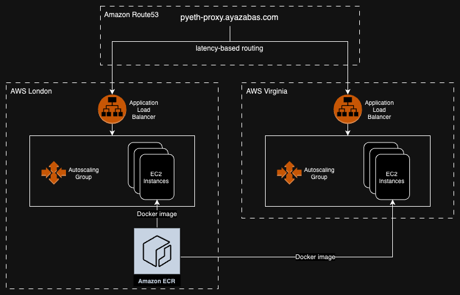
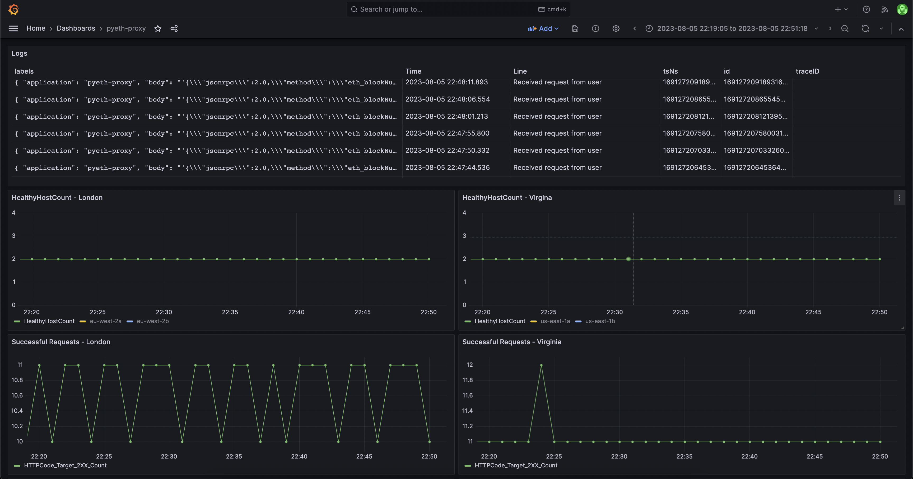

# pyeth-proxy

pyeth-proxy is a Python API for proxying mainnet Ethereum RPC requests to leading RPC providers Alchemy, Infura and QuickNode. Requests are load-balanced across these RPC providers, and if any provider has issues, requests will gracefully fallback to another provider.

Send your Mainnet RPC requests to https://pyeth-proxy.ayazabbas.com

## Features
- Uses FastAPI one of the fastest Python API frameworks both in terms of performance and developer velocity.
- Load-balances requests across multiple RPC providers.
- Gracefully falls back to the next available provider if your initial request fails.
- Global infrastructure achieves low latency for users around the world.
- Built-in shipping of logs to Loki.

## Run it locally
- Ensure you have docker & docker-compose installed
- Clone the repo:
```
git clone git@github.com:ayazabbas/pyeth-proxy.git
cd pyeth-proxy
```
- Build the image
```
docker build -t pyeth-proxy .
```
- Set environment variables
```
export IMAGE_TAG=pyeth-proxy
export RPC_PROVIDERS_HTTP=https://provider-1.com,https://provider-2.com,https://provider-3.com
```
- Run docker-compose
```
docker-compose up
```
- Try it out
```
curl --url localhost:8000 -X POST -H "Content-Type: application/json" -d '{"jsonrpc":"2.0","method":"eth_blockNumber","params":[],"id":1}'
```

## Infrastructure


### Docker
- The [Github Action](https://github.com/ayazabbas/pyeth-proxy/actions/workflows/build.yml) in this repo builds and publishes a docker image to Amazon Elastic Container Registry.
- The [docker-compose.yml](./docker-compose.yml) file encapsulates everything required to run the application.

### Terraform
- Deployed on AWS.
- Uses [Hashicorp Terraform](https://www.terraform.io/) for infrastructure as code.
- Infrastructure as Code offers us several benefits:
  - Repeatability, Speed, Consistency - we can deploy the same architecture to multiple environments in multiple accounts, and trivially teardown/redeploy environments.
  - Accountability, Visibility, Security - by enforcing infrastructure changes to be made in code, we can keep track of what's changing and who's doing it.
- The infrastructure is globally distributed and latency-based DNS routing gives users best latency based on their location.
- Modularised Terraform makes it trivial to deploy more regions.
- The Terraform code is separated into:
  - The [module](infrastructure/terraform/modules/aws_alb_asg/) - defines the resources required to run the app, in an account and region agnostic way.
  - [Production configuration](infrastructure/terraform/production/) - deploys the module in multiple regions, configures DNS, and includes account-specific details.
- The code in [terraform/production](infrastructure/terraform/production/) is specific to my AWS account and references the following manually created resources:
  - VPCs and Subnets
  - Amazon Elastic Container Registry
  - Route53 DNS hosted zone
  - AWS Secrets Manager secret - environment variables are saved here and referenced during Terraform execution

### Scalability
- The application is deployed on EC2 instances running Ubuntu, using Amazon's Autoscaling Groups (ASG).
- The ASG is configured to horizontally scale based on a target average CPU usage of 50% across all instances.
- The number of instances will fluctuate between the minimum and maximum values specified (currently 2 and 4, respectively) to meet this CPU target.

### Uptime & Reliability
- A [startup script](infrastructure/terraform/production/templates/user_data.sh.tpl) which runs on every instance pulls the latest docker image from ECR and configures a systemd service to run the application in docker-compose.
- This offers multiple layers of automatic recovery:
  - If a container fails, docker-compose will exit and the systemd service will restart.
  - If the application healthchecks continue to fail, the load-balancer will mark the instance as unhealthy and the Autoscaling Group will launch a new one to replace it.

### Monitoring and Alerting
- AWS records a bunch of metrics for us by default - this is accessible via the *Cloudwatch* service.
- We use Grafana cloud and have configured Cloudwatch as a data source - this allows us to build a dashboard to view important metrics.
- We have alerting in place for some of these metrics, such as healthy instance count or number of HTTP 5XX errors.


## Future Improvements

### Application
- Websockets - currently only http requests are supported.
- Smart error handling - right now, any error is retried with a different provider, until it works or all providers have been tried. We should check if the error is due to an incorrect request vs an issue with the provider, and maybe handle them differently.
- Multiple networks - add support for multiple evm networks.
- API keys - will help us identify users' requests, so we can track-down issues more effectively. 
- Rate-limiting - for DOS prevention (should be done at both the app-level and infrastructure-level).

### Infrastructure
- Automated deployments - both Infrastructure provisioning, and updating the running version of the app are currently a manual process.
- CDN - using a content distribution network can provide further latency benefits for users, even though all requests still go to origin. The benefits would come from SSL termination at the edge, and relying on the CDN provider's optimised networking path from edge to origin.
- Autoscaling - no testing has been done to measure the effectiveness of current autoscaling policies. Perhaps there is a metric (such as request count) which would be better than avg CPU usage that we should be scaling on.
